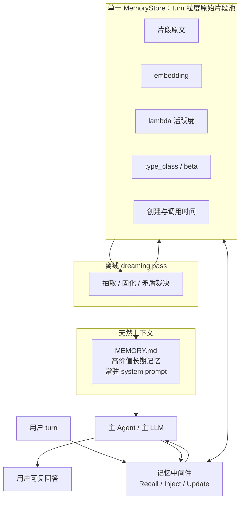
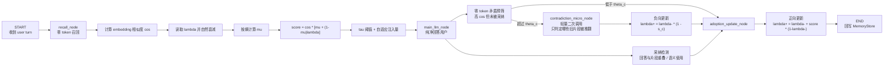
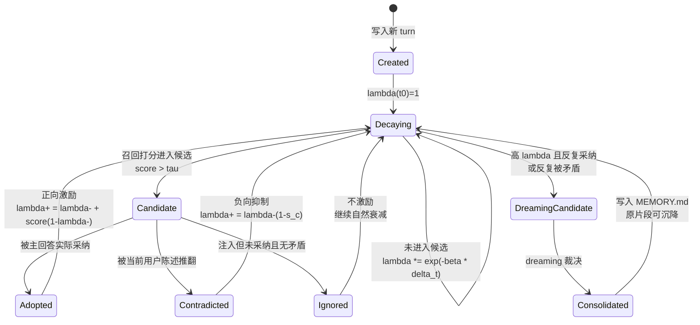
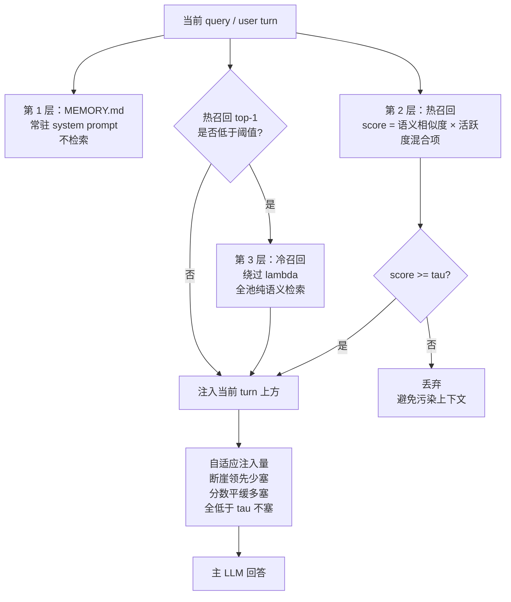
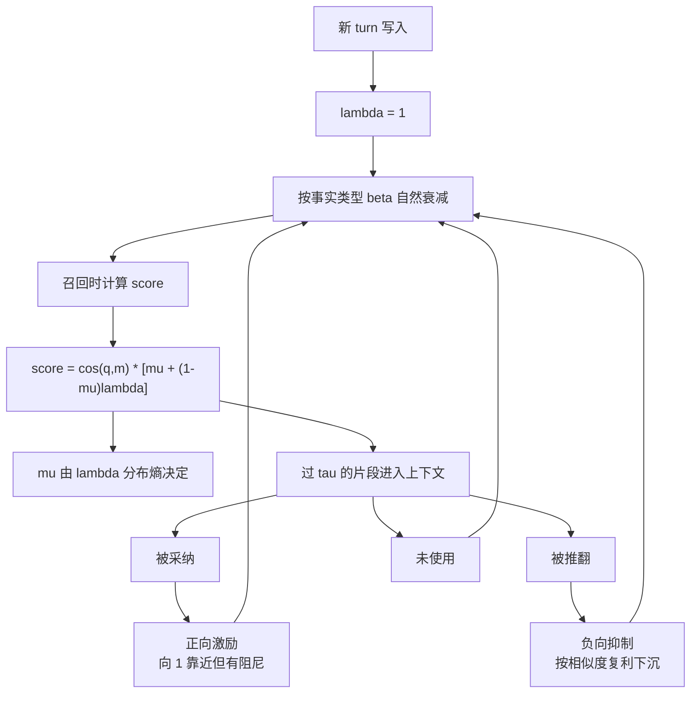

# 基于使用动力学的 Agent 记忆系统架构图

本文把 `originidea.md` 的 λ 动力学机制和 `memory-system-design-v2.md` 的系统设计合并成几张图。核心直觉是：记忆不是被 LLM 高频整理出来的，而是先作为 turn 粒度片段进入统一记忆池；白天靠确定性中间件做召回、衰减、激励和矛盾降权；夜间再用 dreaming 对高价值幸存者做低频巩固与裁决。

## 1. 总体架构

要点：

- 只有一个主 Agent，记忆系统是夹在 Agent 与存储之间的无状态确定性中间件。
- MemoryStore 不分冷热库，冷热只是同一池内 λ 高低形成的连续光谱。
- MEMORY.md 是最高层长期记忆，来自夜间 dreaming 的低频巩固。

## 2. 日间在线运行流程

这张图对应 LangGraph 的 5 节点结构：`recall_node -> main_llm_node -> contradiction_micro_node? -> adoption_update_node`。矛盾节点只在预筛报警时触发，因此日常路径仍然接近零额外 token。

## 3. λ 活跃度状态机

核心闭环：

- 越被真正使用，λ 越强。
- 越久不用，λ 自然衰减。
- 被新事实推翻，λ 主动下沉，但原文不删除，仍可被冷召回或夜间裁决使用。

## 4. 三层召回与注入策略

这里的关键不是“永远塞 top-k”，而是允许系统沉默。低相关、低活跃、过时的片段会被 τ 阈值挡掉；如果用户刻意找旧信息，冷召回仍能兜底。

## 5. 评测与消融架构

```mermaid
flowchart LR
    Dataset["评测集<br/>LoCoMo / LongMemEval"] --> Harness["Benchmark Harness"]
    Harness --> System["Full System<br/>LangGraph + MemoryStore"]
    Harness --> Baselines["Baselines<br/>Mem0 / Zep / full-context / pure RAG"]

    subgraph SystemNodes["可替换节点"]
        R["recall_node<br/>lambda / mu / tau / cold recall"]
        L["main_llm_node"]
        C["contradiction_micro_node"]
        U["adoption_update_node"]
        D["dreaming_pass"]
    end

    System --> SystemNodes

    SystemNodes --> Metrics["必报指标<br/>accuracy<br/>每 query LLM 调用数<br/>每 query token 数"]

    subgraph Ablation["类别 - 机制消融"]
        A1["knowledge update<br/>关 contradiction_micro / 关 dreaming 裁决"]
        A2["temporal reasoning<br/>单一 beta"]
        A3["abstention<br/>固定 top-k 且无 tau"]
        A4["multi-session<br/>关冷召回 / 关 MEMORY.md"]
        A5["single-session recall<br/>score 退化为纯 cos"]
    end

    SystemNodes --> Ablation
    Baselines --> Metrics
    Ablation --> Metrics
```

评测设计的重点是把“准确率”和“成本曲线”一起报。这个系统的主张不是只追求分数，而是证明：日间大部分记忆操作是确定性零 token，只有稀疏矛盾分诊和低频 dreaming 消耗 LLM。

## 6. 机制速览

一句话版：这是一个让记忆“越用越强、越不用越弱、被推翻则主动降权”的动态 RAG 系统。
