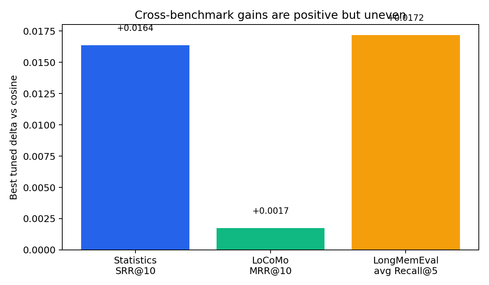
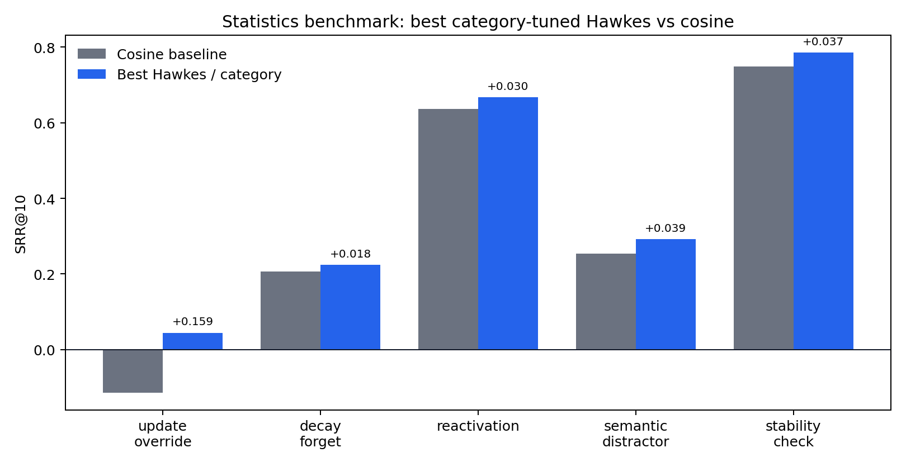
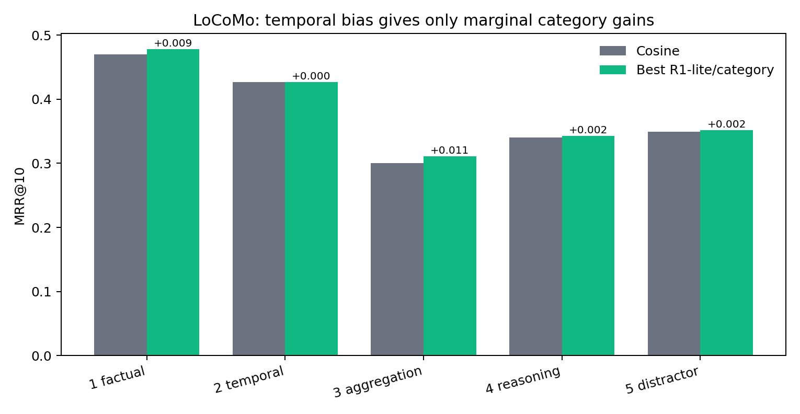
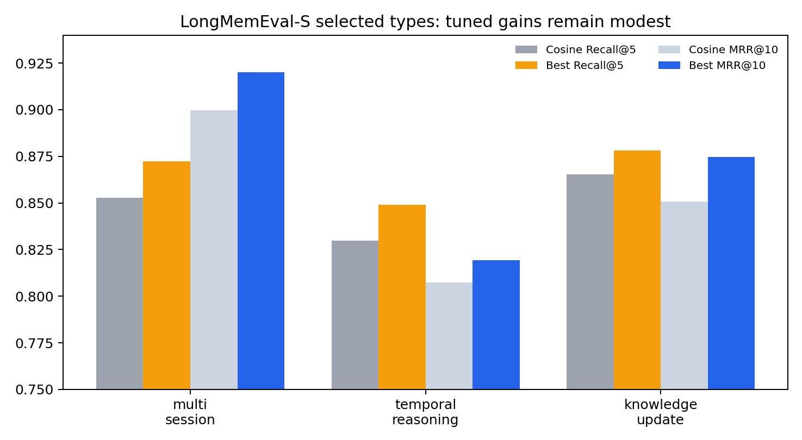

# OriginIdea 初步试验结果分析报告

生成日期：2026-05-17

## 1. 核心结论

OriginIdea 的当前机制可以概括为：在传统向量相似度检索之外，为每条记忆维护一个随时间衰减、随成功调用而增强的活跃度 `lambda(t)`，并用动态 `mu` 将语义相似度与记忆活跃度混合为最终召回分数。

初步实验显示，这个方向是有信号的，但还没有达到“可以直接投顶会”的强度：

1. 在自建 turn-level statistics benchmark 上，Hawkes/激励衰减机制明显优于 cosine baseline。全量 100 个 scenario 上，最佳 Hawkes 配置 `T_half=1d, mu_base=0.8, intermediate_top_k=3` 将 SRR@10 从 `0.3462` 提升到 `0.3625`，W/T/L 为 `51/26/23`。
2. 在 LongMemEval-S 的三个目标类型上，调参后有小幅正收益，尤其 `multi-session` 和 `knowledge-update` 的 Recall@5 有提升，但逐题 W/T/L 中 tie 占绝对多数，说明机制只影响一小部分边界样本。
3. 在 LoCoMo 上，最佳 R1-lite 配置 `T_half=90d, mu_base=0.9` 的 MRR@10 仅从 `0.3730` 到 `0.3747`，W/T/L 为 `25/1940/17`。这更像轻微排序扰动，而不是强机制收益。
4. 当前机制的优势主要来自“把干扰项往下压”和“让被反复触发的稳定/重激活记忆保持可见”。它还不擅长处理需要多证据聚合、显式时间推理、事实覆盖链路解释的任务。



## 2. 方法假设

当前方案的评分函数为：

```text
score_i = cos(q_i, m) * [mu + (1 - mu) * lambda^-(t_i)]
```

其中 `lambda` 初始为 1，未调用时按指数衰减，被成功召回后按当前 score 获得激励。`intermediate_top_k` 控制每次检索中有多少候选会被视作“成功调用”并触发增强。

这个设计试图给 RAG 加入三种归纳偏置：

1. **使用强化**：被多次相关查询触发的记忆更容易继续被召回。
2. **自然遗忘**：长时间未被使用的记忆权重下降。
3. **自适应噪音控制**：当活跃度分布很集中时，动态 `mu` 增大，让语义相似度重新占据更多话语权，避免单个高活跃记忆垄断排序。

该假设与人的长期记忆直觉一致，但论文层面必须证明：这种动态偏置不是“调参后的 recency trick”，而是在特定问题结构上稳定、可解释、可复现地优于纯语义检索、recency、time-decay、session-level retriever、agentic memory 等强基线。

## 3. Benchmark 与指标

### 3.1 自建 Statistics Benchmark

自建数据集共 100 个中文长期对话 scenario，每类 20 个，检索单位为完整 turn。五类问题分别是：

| 类别 | 目标 |
|---|---|
| `update_override` | 新事实覆盖旧事实 |
| `decay_forget` | 稳定偏好压过一次性兴趣 |
| `reactivation` | 主题 cue 重新唤起早期低频记忆 |
| `semantic_distractor` | 当前目标压过相似干扰目标 |
| `stability_check` | 低频稳定事实仍可召回 |

核心指标是 SRR@K：对 top-K 内 positive 与 negative 分别计算 reciprocal rank，再用 positive 得分减去 negative intrusion 得分。因此它不仅看能不能找到正确记忆，也惩罚“同时把错误旧事实排得很高”的副作用。

### 3.2 LoCoMo

LoCoMo 评估超长多轮对话记忆，当前 sweep 使用 1982 个问题，检索单位为 session，embedding 为 MiniLM，主指标为 Recall@10、Hit@1/5、MRR@10、SRR@10。问题分为 single-session factual、single-session temporal、multi-session aggregation、multi-session reasoning、adversarial/distractor 五类。

### 3.3 LongMemEval-S

LongMemEval-S 总体有 500 个问题，本轮只跑了 `multi-session`、`temporal-reasoning`、`knowledge-update` 三类，共 344 个问题。三类平均 session 数都约 50，但时间跨度差异很大：`multi-session` 平均 8.21 天，`temporal-reasoning` 28.14 天，`knowledge-update` 96.55 天。

## 4. 实验结果

### 4.1 Statistics: 机制信号最强

全量 statistics 结果：

| mechanism | best recipe | SRR@10 | positive recall@10 | negative intrusion@10 | pair win | W/T/L vs cosine |
|---|---|---:|---:|---:|---:|---:|
| cosine | R0_cosine | 0.3462 | 0.8598 | 0.6448 | 0.7633 | 0/100/0 |
| cosine_recency | R2_cosrec_T60d_mu0.8 | 0.3357 | 0.8388 | 0.6475 | 0.7550 | 30/42/28 |
| hawkes | R3_hawkes_T1d_mu0.8_k3 | 0.3625 | 0.8396 | 0.6270 | 0.7708 | 51/26/23 |

Hawkes 的 positive recall 低于 cosine，但 negative intrusion 也更低，SRR 最终更高。这说明当前机制的主要价值不是“召回更多正例”，而是“在正确记忆和误导记忆同时相似时，改善排序副作用”。



按类别看：

| category | best recipe | SRR@10 | positive recall@10 | negative intrusion@10 | pair win | rank margin |
|---|---|---:|---:|---:|---:|---:|
| decay_forget | R3_hawkes_T1d_mu0.8_k5 | 0.2243 | 0.5975 | 0.1987 | 0.7833 | 7.10 |
| reactivation | R3_hawkes_T1d_mu0.8_k5 | 0.6671 | 1.0000 | 0.8250 | 1.0000 | 5.25 |
| semantic_distractor | R3_hawkes_T60d_mu0.2_k1 | 0.2923 | 0.7500 | 0.6333 | 0.7250 | -0.70 |
| stability_check | R3_hawkes_T1d_mu0.4_k1 | 0.7860 | 1.0000 | 0.6492 | 1.0000 | 5.20 |
| update_override | R3_hawkes_T7d_mu0.2_k1 | 0.0444 | 0.4523 | 0.4417 | 0.5125 | -0.10 |

关键观察：

1. `stability_check` 和 `reactivation` 最适合当前机制，因为“被使用过的记忆继续保持可见”与任务结构一致。
2. `decay_forget` 有一定收益，说明衰减机制能压低一次性兴趣或短期噪音。
3. `update_override` 是最弱项。它需要的是“新事实覆盖旧事实”的显式版本管理，而不是单纯依赖时间衰减或使用强化。
4. `semantic_distractor` 仍有负 rank margin，说明相似干扰目标的排序问题并没有真正解决。

### 4.2 LoCoMo: 整体几乎打平

LoCoMo 上 cosine baseline 已经很强：

| recipe | recall@10 | hit@1 | hit@5 | MRR@10 | SRR@10 | W/T/L |
|---|---:|---:|---:|---:|---:|---:|
| R0_cosine | 0.6201 | 0.2634 | 0.5106 | 0.3730 | 0.3986 | 0/1982/0 |
| R1_lite_T90d_mu0.9 | 0.6235 | 0.2674 | 0.5086 | 0.3747 | 0.4002 | 25/1940/17 |

最佳配置的改进幅度非常小：Recall@10 `+0.0034`，MRR@10 `+0.0017`。逐题只有 25 胜、17 负，其余 1940 题完全打平。



分类上，R1-lite 在 single-session factual、multi-session reasoning、adversarial/distractor 上略有收益；但 multi-session aggregation 更容易受损。这与机制假设吻合：聚合类问题需要保留多个时间点的证据，过强的时间/活跃度偏置会把旧证据压下去。

### 4.3 LongMemEval-S: 小幅正收益，但覆盖面有限

LongMemEval-S 三类结果如下：

| question type | cosine Recall@5 | best Recall@5 | cosine MRR@10 | best MRR@10 | W/T/L of best recall |
|---|---:|---:|---:|---:|---:|
| multi-session | 0.8526 | 0.8723 | 0.8997 | 0.9199 | 11/118/4 |
| temporal-reasoning | 0.8298 | 0.8489 | 0.8072 | 0.8194 | 6/125/2 |
| knowledge-update | 0.8654 | 0.8782 | 0.8509 | 0.8746 | 4/72/2 |



这里的结果比 LoCoMo 更积极，但仍要谨慎：

1. 三类都有正向最佳配置，说明机制不是只在自建数据上有效。
2. 逐题 tie 仍占多数，说明目前只是对少量排序边界样本有帮助。
3. `knowledge-update` 的提升有意义，但它应该是最能体现“新旧事实竞争”的场景。当前只做到小幅提升，说明机制还缺少显式冲突检测和版本化记忆。

## 5. 失败模式

### 5.1 Update Override 不是纯衰减问题

`update_override` 在 statistics 上 SRR@10 只有 `0.0444`，rank margin 仍为 `-0.10`。原因可能是：旧事实和新事实语义高度相似，单纯让旧事实衰减并不能保证新事实赢；如果旧事实被多次查询激活，甚至可能被强化。

需要把“事实是否被覆盖”建模为结构关系，而不是希望时间衰减自己解决。

### 5.2 语义干扰需要目标绑定

`semantic_distractor` 的最佳 SRR@10 为 `0.2923`，但 rank margin 为 `-0.70`。这说明 Hawkes 能减少一部分负例侵入，但无法稳定识别“当前目标实体”。

需要引入 entity/event-level memory、目标状态、query intent 与 memory role 的匹配，而不是只靠 turn/session embedding。

### 5.3 多证据聚合会被动态偏置伤害

LoCoMo multi-session aggregation 类别中，时间偏置可能压低较早证据；LongMemEval multi-session 虽有正收益，但最佳配置也不是强胜。因此，如果论文主张“长期记忆系统”，必须专门解决多证据覆盖率，而不能只优化单证据 top-rank。

### 5.4 当前 sweep 缺少统计显著性和跨 embedding 验证

目前结果主要是点估计。顶会审稿会追问：

1. 换 embedding 是否仍成立？
2. 换 top-k、换 query rewrite、换 chunk 粒度是否仍成立？
3. 数据集随机种子、样本扩增、bootstrap 置信区间是否支持结论？
4. 最佳超参是否在 dev/test split 上过拟合？

## 6. 顶会论文还需要怎么做

### 6.1 把论文贡献从“一个公式”升级成“动态记忆检索框架”

当前公式有直觉，但贡献边界还不够强。建议将方法扩展为一个完整框架：

1. **Memory state**：每条记忆不只有 `lambda`，还应包含 entity、topic、validity interval、source confidence、last confirmed time、conflict set。
2. **State transition**：调用、确认、覆盖、否定、沉睡、重激活分别对应不同更新规则。
3. **Retrieval score**：由 semantic relevance、activation、temporal validity、conflict freshness、coverage gain 共同决定。
4. **Read-write loop**：检索结果进入 LLM 后，LLM 或规则模块可以产生 memory update event，而不只是被动增强 top-k。

这样论文题目可以从“带 Hawkes 衰减的 RAG”提升为“side-effect-aware dynamic memory retrieval for long-term conversational agents”。

### 6.2 增加强基线

至少需要比较：

| 基线 | 为什么必须有 |
|---|---|
| pure cosine / BM25+embedding hybrid | 基础检索强基线 |
| recency-only / time decay | 证明不是简单近因偏置 |
| cosine + recency interpolation | 当前已有，应保留 |
| query rewriting / temporal query expansion | 时间问题常见强 baseline |
| reranker, cross-encoder, LLM reranking | 审稿人会认为 rerank 可能直接解决 |
| MemGPT-style memory management | 长期 agent memory 代表性系统 |
| A-MEM / agentic memory organization | 动态记忆组织方向 |
| temporal knowledge graph memory, 如 Zep | 覆盖 update 与实体关系 |
| long-context oracle | 衡量检索模块上限 |

### 6.3 做消融实验

建议最少包括：

1. no decay：`beta=0`，退化为 cosine。
2. fixed `mu` vs entropy-adaptive `mu`。
3. no excitation：只衰减不增强。
4. no decay：只增强不衰减。
5. `intermediate_top_k` sweep。
6. turn-level vs session-level vs fact-level memory。
7. positive-only recall vs side-effect-aware SRR。
8. with/without conflict-aware update module。

尤其要证明动态 `mu` 的必要性。目前结果中高 `mu` 常表现较稳，但 `mu` 的熵自适应优势还没有单独被证明。

### 6.4 改进 Benchmark

自建 statistics benchmark 很有价值，因为它显式标注 positive 与 negative。但顶会需要进一步补强：

1. 扩到至少 500-1000 个 scenario，并做人工抽检。
2. 给每个 scenario 加 fact/event/entity 标注，支持 turn-level 与 fact-level 双粒度评估。
3. 增加 answer generation 评测，不能只看检索排序。
4. 引入 adversarial temporal cases：旧事实被多次提及、新事实只出现一次、旧事实近期被否定、短期例外与长期偏好冲突。
5. 公开 dev/test split，所有超参只在 dev 上选。
6. 报告 bootstrap confidence interval 与 paired significance test。

### 6.5 方法改进优先级

优先级建议：

1. **版本化记忆和冲突图**：解决 `update_override`，把 old/new fact 建成显式覆盖关系。
2. **实体与目标绑定**：解决 `semantic_distractor`，让 query 中的目标实体和候选记忆实体对齐。
3. **覆盖率感知的多证据检索**：解决 LoCoMo aggregation，把 top-k 从独立排序改为 diversity/coverage selection。
4. **可学习参数**：从手调 `T_half, mu_base, k` 变成小模型或 bandit policy，根据 query 类型选择动态策略。
5. **检索后验证器**：让 LLM 或轻量 verifier 判断候选是否“当前有效”“被覆盖”“只是相似干扰”。

## 7. 需要研究的相关工作

建议把相关工作分成四条线：

1. **长期对话记忆 benchmark**：LongMemEval 评估信息抽取、多 session 推理、时间推理、知识更新和拒答；LoCoMo 聚焦超长多模态对话记忆。还应关注 2026 年出现的 LongMemEval-V2 和 LoCoMo-Plus，它们更强调经验型/认知型记忆。
2. **Agent memory system**：MemGPT 用虚拟上下文管理类比 OS memory；A-MEM 用 Zettelkasten 和 agent-driven decision 做动态记忆组织；Zep 用 temporal knowledge graph 管理 agent memory。
3. **Temporal RAG / time-aware retrieval**：包括 recency decay、temporal metadata filtering、fuzzy time expression resolution、temporal graph RAG。这条线能帮助把 Hawkes 衰减和已有 time-aware retrieval 区分开。
4. **Cognitive memory 与 temporal point process**：Hawkes process、自激励点过程、遗忘曲线、spacing effect、reinforcement/reconsolidation。论文需要说明为什么 `lambda` 更新不是随意经验公式，而是可解释的记忆动力学近似。

可作为起点的论文与资料：

| 方向 | 参考 |
|---|---|
| 长期记忆 benchmark | [LongMemEval](https://arxiv.org/abs/2410.10813), [LoCoMo](https://arxiv.org/abs/2402.17753) |
| 最新 benchmark | [LongMemEval-V2](https://arxiv.org/abs/2605.12493), [LoCoMo-Plus](https://arxiv.org/abs/2602.10715) |
| agent memory | [MemGPT](https://arxiv.org/abs/2310.08560), [Generative Agents](https://arxiv.org/abs/2304.03442), [A-MEM](https://arxiv.org/abs/2502.12110), [Zep](https://arxiv.org/abs/2501.13956) |
| temporal retrieval | [DeFuzzRAG](https://ojs.aaai.org/index.php/AAAI/article/view/40276), [Temporal GraphRAG](https://arxiv.org/abs/2510.13590) |

## 8. 下一阶段实验计划

建议用 4 周做一个顶会可行性版本：

| 周期 | 目标 | 输出 |
|---|---|---|
| Week 1 | 固定 dev/test split，补 bootstrap CI，复跑 qwen/minilm/bge/e5 | 可信结果表 |
| Week 2 | 加 conflict graph + versioned memory，重点攻 `update_override` | 方法 v2 |
| Week 3 | 加 entity binding + coverage-aware selection，重点攻 distractor 和 aggregation | 方法 v3 |
| Week 4 | 与 reranker、query rewrite、temporal KG baseline 比较，写 ablation | 论文核心实验 |

短期论文判断标准：

1. 在 statistics test split 上，Hawkes v2 相比 cosine 的 SRR@10 提升至少 `+0.05`，并且五类中至少四类正收益。
2. 在 LongMemEval-S 上，三类平均 Recall@5 或 MRR@10 提升至少 `+0.02`，并通过 bootstrap 显著性检验。
3. 在 LoCoMo 上，不要求大幅赢，但不能伤害 aggregation；如果整体提升仍小，应把 LoCoMo 定位为“通用 benchmark 上保持不退化”。
4. answer generation 端必须能体现检索收益，否则论文会被认为只是检索排序调参。

## 9. 总体判断

OriginIdea 目前最像一个“side-effect-aware dynamic memory retrieval”的早期原型。它在有明确正负记忆竞争的自建 benchmark 上已经有可信信号，尤其能降低误导记忆的副作用；但在公开 benchmark 上还只是小幅收益。

如果要冲顶会，核心不应只继续 sweep `beta/mu/k`，而应把机制升级为“动态记忆状态 + 显式冲突关系 + 多证据覆盖 + 检索后验证”的完整系统。这样才能从一个有趣公式变成一篇有方法贡献、benchmark 贡献和实证说服力的论文。
